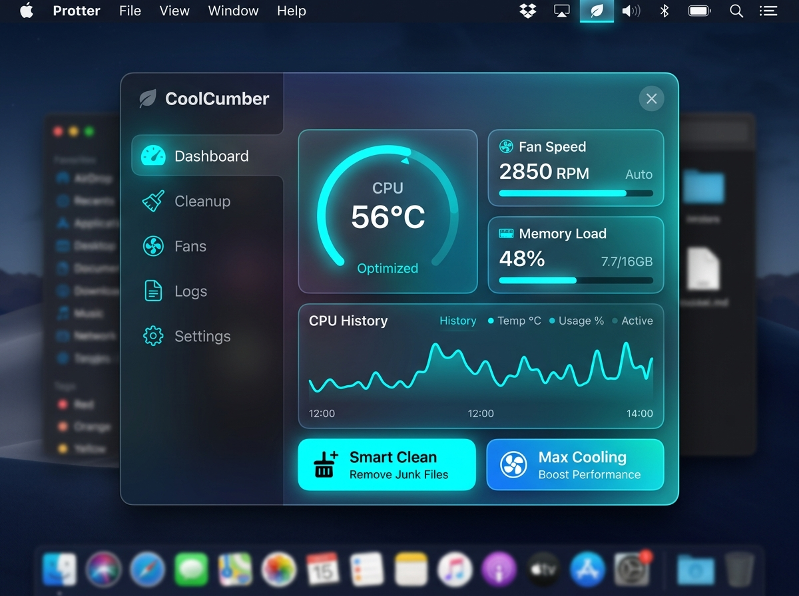
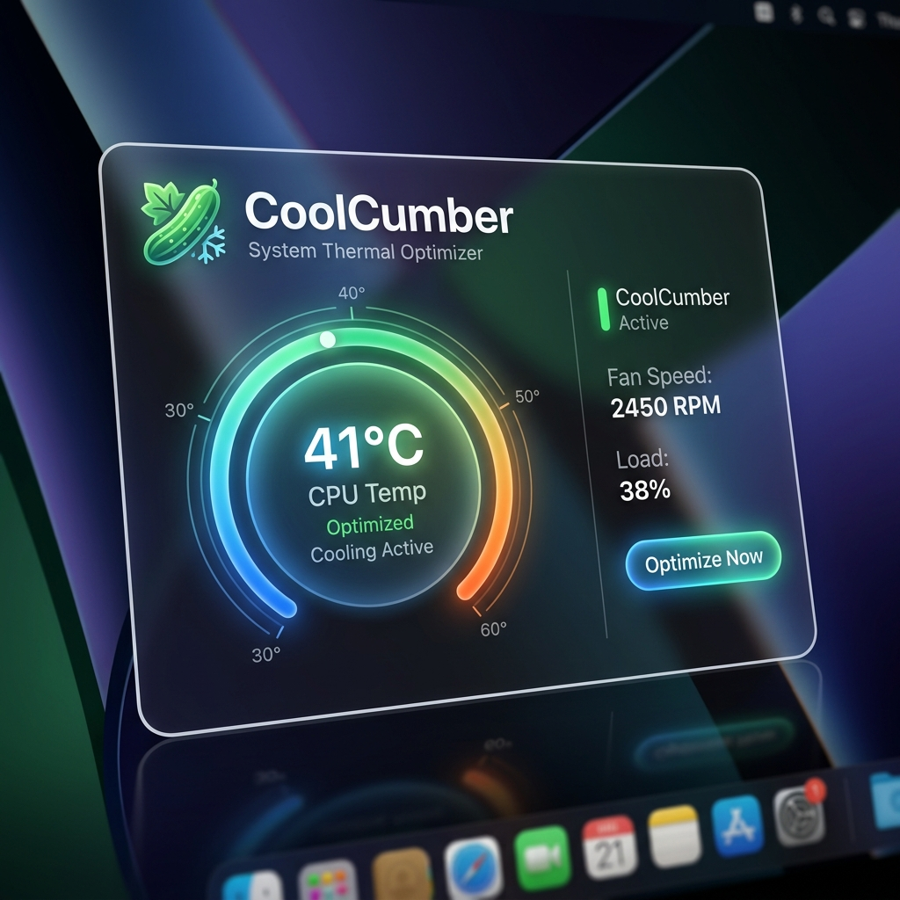

# CoolCumber 🥒

[English](README.md) | **中文**

**CoolCumber** 是一款智能、美观且由 AI 驱动的 Mac 散热与系统优化工具。它诞生于保持 macOS 始终冷静高效的需求，拥有炫酷的 3D 交互界面，并集成了后台进程管理、温度监控与垃圾清理功能。

<p align="center">
  
</p>

---

## 🌟 特色功能

### 🌡️ 极客级温度与电源监控
<p align="center">
  
</p>

- **实时看板**：炫酷的 3D UI 实时展示 CPU 温度、内存占用及电池状态。
- **历史曲线**：直观的 CPU 散热与负载历史折线图，精确显示 40°C～95°C 区间的温度波动变化，助您一目了然地掌握系统热流分布。

### 🛡️ 智能流氓应用杀手 (Rogue App Killer)
- **静默守护**：智能检测并在后台自动分析消耗异常多 CPU 和内存的流氓进程。
- **一键冻结**：遇到顽固占用资源的后台进程，可以一键终止，立刻为系统降温。

### 🧹 全面系统优化器 (System Optimizer)
- **深层扫描**：全面扫描系统和应用程序的缓存文件、临时数据以及无用的日志残留。
- **一键瘦身**：释放宝贵的磁盘存储空间，保持系统的轻盈与极速响应。

### 🤖 Agentic Studio 原生打造
本项目核心代码主要由 Google Antigravity 智能体全自动协作开发完成。无论是底层系统 API 调用，还是高度定制化的炫酷 3D 前端动效，均展示了 Agentic Coding 在现代软件工程中的强大威力。

---

## 🚀 快速上手教程

### 1. 安装方法
1. 前往 [Releases 页面](https://github.com/lastkimi/CoolCumber/releases) 下载最新的 `CoolCumber.dmg`。
2. 双击打开 `.dmg` 文件，将 `CoolCumber` 拖入 **应用程序 (Applications)** 文件夹中。
3. 在启动台中打开 CoolCumber。初次打开时，系统可能会提示授予必要的权限（如完全磁盘访问权限或辅助功能权限），请在系统偏好设置中允许，以便软件能读取温度传感器并清理系统缓存。

### 2. 使用指南
- **查看状态**：点击菜单栏上的雪花/风扇图标，即可展开精美的悬浮看板，查看 CPU、内存和电池的实时百分比与温度。
- **清理垃圾**：切换至“系统清理”面板，点击 **Scan (扫描)**，等待几秒钟分析完成后，点击 **Clean (清理)** 即可释放空间。
- **管理进程**：切换至“应用冻结”面板，查看当前高负载的后台应用，对于不需要的流氓应用直接点击终止。
- **语言切换**：在设置面板中可自由切换中文和英文界面，享受原生的本地化体验。

---

## 🛠️ 从源码编译

如果您希望自行参与开发或编译该项目，您需要提前安装 [XcodeGen](https://github.com/yonaskolb/XcodeGen)（或通过 Homebrew 安装：`brew install xcodegen`）。

1. **克隆仓库**：
   ```bash
   git clone https://github.com/lastkimi/CoolCumber.git
   ```
2. **进入项目目录**：
   ```bash
   cd CoolCumber
   ```
3. **生成 Xcode 项目文件**：
   ```bash
   xcodegen generate
   ```
4. **编译与运行**：
   双击打开生成的 `.xcodeproj` 文件，通过 Xcode 选择您的 Mac 设备进行编译运行。

---

## 📄 开源协议
本项目采用 **MIT 开源协议**。您可以自由地使用、修改并分发本软件。详情请参阅 [LICENSE](LICENSE) 文件。
